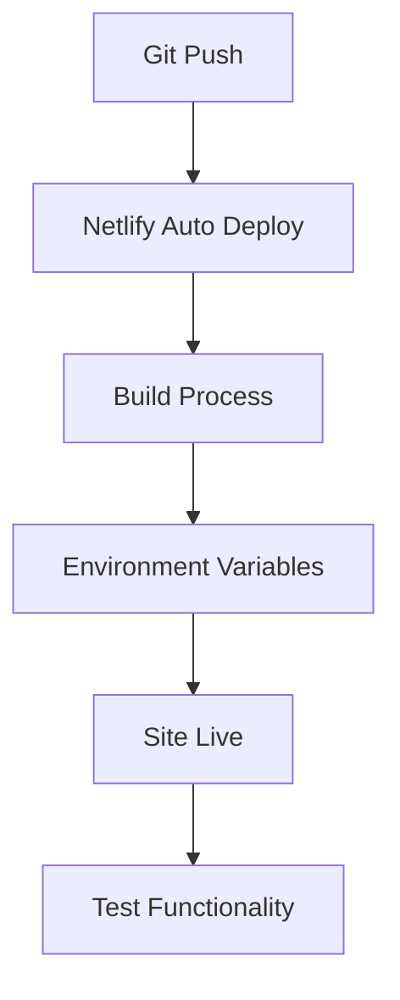

# 🚀 Netlify Deployment Kılavuzu

## 📋 Netlify'da API Anahtarı Ekleme Adımları

### 1. **Netlify Dashboard'a Giriş**
- [app.netlify.com](https://app.netlify.com) adresine gidin
- GitHub hesabınızla giriş yapın

### 2. **Site Ayarlarına Erişim**
```
Sites → pdf-audio-reader → Site settings
```

### 3. **Environment Variables Ekleme**
```
Site settings → Environment variables → Add variable
```

### 4. **API Anahtarı Girişi**
```
Variable name: VITE_GEMINI_API_KEY
Variable value: [Your Gemini API Key]
```

### 5. **Deployment Tetikleme**
```
Deploys → Trigger deploy → Deploy site
```

## 🔧 Alternatif Yöntemler

### **Netlify CLI ile:**
```bash
# CLI kurulumu
npm install -g netlify-cli

# Login
netlify login

# Site'ye bağlan
netlify link

# Environment variable ekle
netlify env:set VITE_GEMINI_API_KEY [Your-API-Key]

# Deploy
netlify deploy --prod
```

### **GitHub Actions ile Otomatik Deployment:**
Repository settings'te secret ekleyin:
```
Settings → Secrets and variables → Actions → New repository secret
Name: VITE_GEMINI_API_KEY
Value: [Your Gemini API Key]
```

## ✅ Doğrulama Adımları

### 1. **Environment Variable Kontrolü**
Netlify'da başarılı deployment sonrası:
- Deploy log'larında `VITE_GEMINI_API_KEY` görülmeli
- Browser console'da API key validation log'ları

### 2. **Fonksiyonellik Testi**
- PDF yükleme test edin
- Play butonu çalışıyor mu?
- Console'da hata var mı?

### 3. **Mobil Test**
- iOS Safari'de test edin
- Android Chrome'da test edin

## 🚨 Güvenlik Notları

### ✅ **Doğru Pratikler:**
- API anahtarı Netlify environment variables'da
- `.env.local` git'e commit edilmiyor
- `netlify.toml`'da gerçek API key yok

### ❌ **Yanlış Pratikler:**
- API key'i kod içinde hardcode etmek
- Public repository'de API key bırakmak
- Environment variable'ı eksik bırakmak

## 🔄 Deployment Süreci



## 📞 Sorun Giderme

### **Problem: API key bulunamadı**
**Çözüm:**
1. Netlify dashboard'da variable'ı kontrol edin
2. Deployment'ı yeniden tetikleyin
3. Build log'larını inceleyin

### **Problem: Build hatası**
**Çözüm:**
```bash
# Local test
npm run build

# Environment kontrol
echo $VITE_GEMINI_API_KEY
```

### **Problem: Audio çalışmıyor**
**Çözüm:**
1. Browser console'ı kontrol edin
2. Network tab'da API request'leri görün
3. HTTPS üzerinden erişim sağlayın

## 🎯 Final Checklist

- [ ] API key Netlify'da ayarlandı
- [ ] Site başarıyla deploy edildi  
- [ ] PDF yükleme çalışıyor
- [ ] Play butonu çalışıyor
- [ ] Mobil cihazlarda test edildi
- [ ] Console'da hata yok
- [ ] HTTPS üzerinden erişilebiliyor

---

**🎉 Tebrikler! PDF Audio Reader artık Netlify'da canlı!**